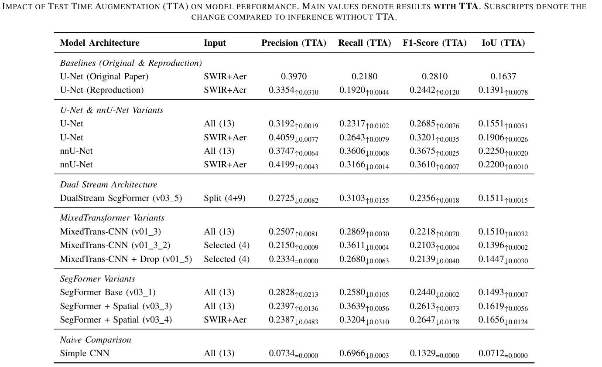

# Sen2Fire: Wildfire Detection Benchmark

This repository contains various deep learning implementations and experiments aimed at benchmarking and improving wildfire detection using the **Sen2Fire** dataset.

Building upon the baseline established in the original paper, we explore different architectures—ranging from Unet, Hybrid Transformer-CNNs to Dual-Stream SegFormers—and input strategies to maximize detection performance on multi-spectral satellite imagery.

### Reference Material
*   **Original Paper:** [SEN2FIRE: A Challenging Benchmark Dataset for Wildfire Detection Using Sentinel Data](https://arxiv.org/abs/2403.17884)
*   **Dataset Download:** [Zenodo - Sen2Fire Dataset](https://zenodo.org/records/10881058)

---

## Repository Structure & Branches

**Note:** The `main` branch currently contains a basic skeleton structure used for testing file organization. **The complete code and trained models for the specific architectures are located in the following branches.**

Please switch to the branch corresponding to the model you wish to explore:

| Model Architecture | Branch Name | Description |
| :--- | :--- | :--- |
| **Mixed Transformer-CNN** | [`MixedTransfomer-CNN_v01_3`](#) | 13-channel Hybrid Encoder |
| **Mixed Transformer-CNN** | [`MixedTransfomer-CNN_v01_3_2`](#) | 4-channel Input Selection |
| **Mixed Transformer-CNN** | [`MixedTransfomer-CNN_v01_5`](#) | Regularized Variant |
| **SegFormer** | [`SegFormer_v03_1`](#) | Baseline MiT-B0 |
| **SegFormer** | [`SegFormer_v03_3`](#) | Spatial Weighting + Augmentation |
| **SegFormer** | [`SegFormer_v03_4`](#) | 4-channel Input Selection |
| **Dual-Stream SegFormer** | [`Dual-Stream-SegFormer_v03_5`](#) | Expert/Context Stream Fusion |

---

## Experimental Results

The table below details the quantitative performance of our different model configurations on the Sen2Fire Test Set.



### Understanding the Metrics & TTA Impact
To maximize detection robustness, we utilized **Test Time Augmentation (TTA)** during inference.

*   **Main Values:** Represent the final results achieved **with** TTA enabled.
*   **Subscript Values (The "Pedix"):** These indicate the **impact of TTA** on the model's performance. Values marked with an arrow show the **improvement (or decrement)** gained by using TTA compared to the standard inference without it.

---

## Model Configurations

We experimented with three primary architectural families, iterating on input strategies (all bands vs. specific indices), loss functions, and regularization techniques.

### 1. MixedTransformer-CNN
A hybrid encoder-decoder architecture combining standard CNN blocks with Transformer bottlenecks to capture both local features and global context.

*   **V01_3**
    *   **Input:** All 13 channels.
    *   **Architecture:** CNN Encoder with Squeeze-and-Excitation (SE) blocks $\rightarrow$ 4-layer Transformer Bottleneck (32x32 feature map) $\rightarrow$ ASPP $\rightarrow$ U-Net Decoder.
    *   **Training:** `BCE_FT` (Binary Cross Entropy + Focal Tversky), `LR: 3e-4`.
    *   **Imbalance Handling:** `WeightedRandomSampler` + `pos_weight`.

*   **V01_3_2**
    *   **Change:** Input reduced to **4 channels** (B12, B8, B4, Aerosol).
    *   *Focus:* Feature selection and dimensionality reduction.

*   **V01_5**
    *   **Change:** Added `Dropout(0.3)` in decoder blocks.
    *   **Training:** Loss changed to `BCE_DICE`. LR reduced to `8e-5`.
    *   *Focus:* Regularization and stability.

### 2. SegFormer
Implementation of the SegFormer architecture using the NVIDIA MiT-B0 encoder.

*   **V03_1**
    *   **Input:** All 13 channels.
    *   **Architecture:** MiT-B0 Encoder $\rightarrow$ MLP Decoder.
    *   **Training:** `BCE_DICE`, `LR: 1e-4`, `Weight Decay: 1e-4`.
    *   **Imbalance Handling:** `WeightedRandomSampler` (2x to 20x boost for fire tiles).

*   **V03_3**
    *   **Change:** Implemented **Spatial Pixel Weighting** (loss map based on historical fire frequency per coordinate).
    *   **Augmentation:** Added `RandomColorJitter` and `RandomGaussianBlur`.
    *   **Training:** LR reduced to `1e-5`.
    *   *Focus:* Spatial attention and aggressive regularization.

*   **V03_4**
    *   **Change:** Input reduced to **4 channels**. `RandomColorJitter` disabled.

### 3. Dual-Stream SegFormer
A novel approach splitting the input into "Expert" (high-signal) and "Context" streams.

*   **V03_5**
    *   **Architecture:**
        1.  **Stream 1 (Expert):** MiT-B0 encoder on bands B12, B8, B4, Aerosol.
        2.  **Stream 2 (Context):** MiT-B0 encoder on the remaining 9 bands.
        3.  **Fusion:** Feature maps concatenated at 4 scales $\rightarrow$ 1x1 Conv fusion $\rightarrow$ MLP Head.
    *   **Training:** `BCE_DICE` with **Spatial Pixel Weighting**. `LR: 1e-5`.

---

## Getting Started

To run these models, please follow the steps below:

1.  **Clone the repository:**
    ```bash
    git clone https://github.com/TitoNicolaDrugman/Sen2Fire-Wildfire-Detection.git
    cd Sen2Fire-Wildfire-Detection
    ```

2.  **Checkout the specific branch:**
    ```bash
    # Example: To use the Dual Stream model
    git checkout Dual-Stream-SegFormer_v03_5
    ```

3.  **Install dependencies:**
    *(Ensure you have a requirements.txt in your branches, otherwise list key libs here)*
    ```bash
    pip install -r requirements.txt
    ```

---

## Citation

If you use the dataset or the original methodology, please cite the original work:

```bibtex
@article{xu2024sen2fire,
  title={Sen2Fire: A Challenging Benchmark Dataset for Wildfire Detection Using Sentinel Data},
  author={Xu, Yonghao and Berg, Amanda and Haglund, Leif},
  journal={arXiv preprint arXiv:2403.17884},
  year={2024}
}
```
